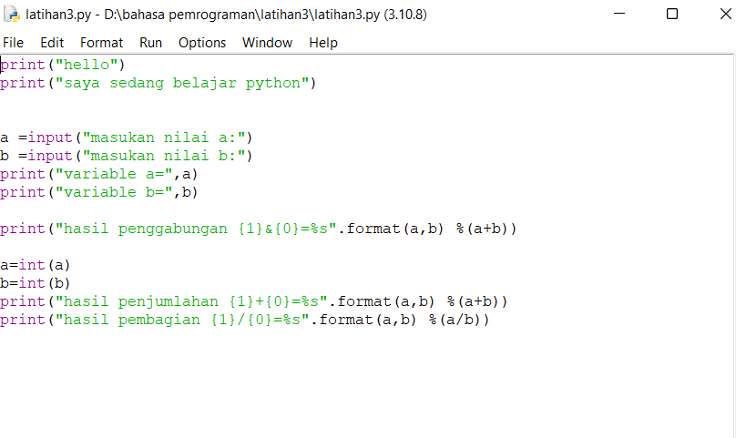

# Latihan3 Belajar Menggunakkan python
## Instal Python
Download pyhton di web resmi python.org sesuai os yang di pakai  
Instal dan centang Add Path untuk menambahkan path agar bisa menjalankan python menggunakan cmd 
 
## Membuat File Python 
### Latihan1 Menampilkan "Hello" dan "Saya sedang belajar Python" di layar 
pertama buka VScode dan buat file baru file.py dan masukan perintah pada gambar 
 
Untuk menjalankannya bisa melalui VSCode atau CMD  
Jika  melalui VScode maka hasilnya seperti ini 
 
Jika melalui CMD maka hasilnya seperti ini 
 
## Latihan2 Menjumlahkan dua buah bilangan variable A dan B 
Masukan Variable untuk A Dan B 
 
Masukan perintah print untuk menampilkan hasil penjumlahan A dan B 
 
Jika Menjalakan melalui VScode hasilnya seperti ini 
 
Jika melalui CMD maka hasilnya seperti ini 
 
## Menjalakan IDLE 
pertama download terlebih dahulu Pycharm di web https://www.jetbrains.com/pycharm/download 
 
Jika sudah terinstal buka aplikasinya dan buat project baru dengan file latihan3.py 
 
Jika sudah lanjut ke pengkodingan dan gunakan fungsi input dari keyboard  
Pertama masukan VAriable diikuti dengan perintah input untuk memasukan nilai variable berikut 
 
Selanjutnya tampilkan nilai variable yang di inputkan 
 
Lalu cetak kedua variable dan gabungkan dengan format string 
 
Lanjut konversi variable 
Ubah interger a dan b seperti gambar 
 
Jika sudah disini kita melakukan dua pengolahan yaitu penjumlahan dan pembagian caranya seperti penggabungan diatas 
 
Dan untuk Menampilkan hasilnya seperti ini 
 
Jika menampilkan CMD seperti ini 
 
Jika menggunakan IDLE Python 
Pertama buka IDLE python 
pilih file baru,open file latihan3.py, lalu bukka file tersebut 
 
Jika ingin menjalankannya klik Run module maka tampilannya akan seperti ini 
 
## Sekian dan Terimakasihhh

